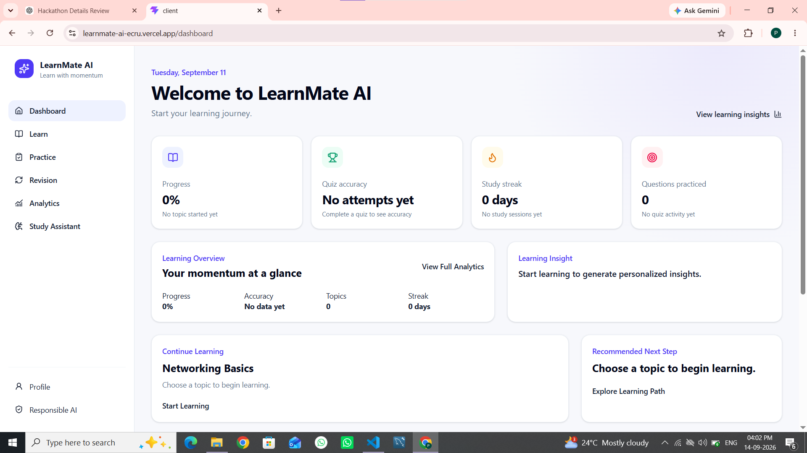
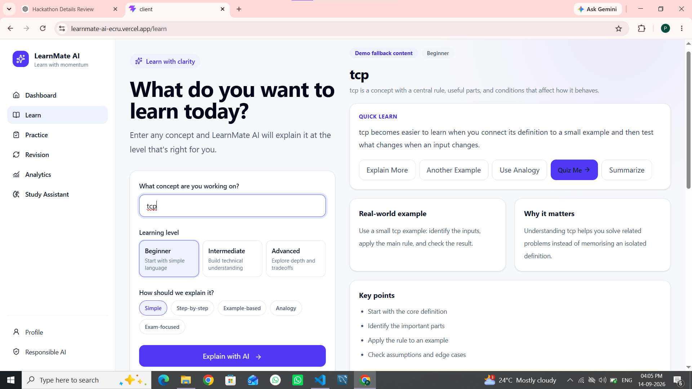
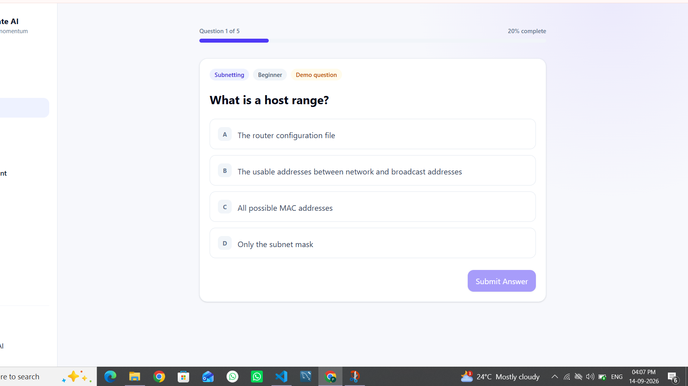
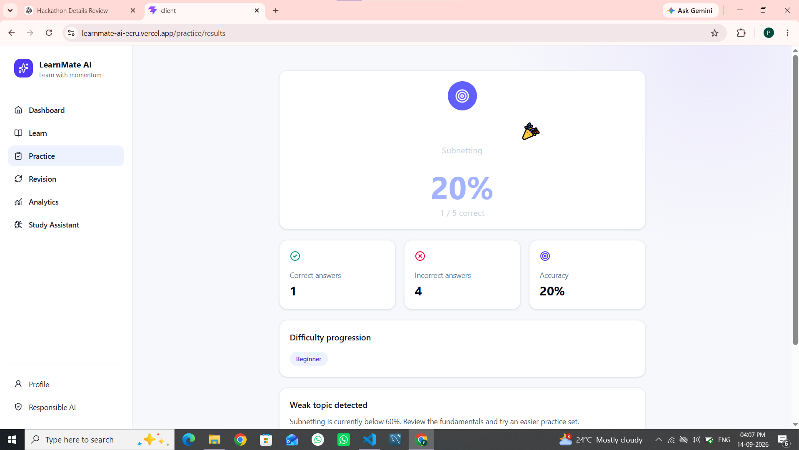
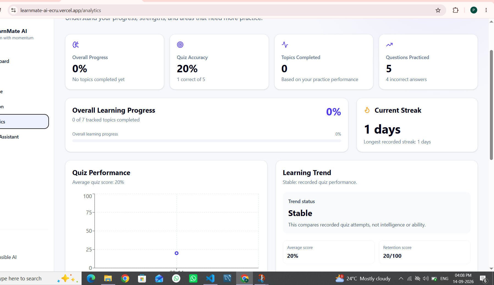

# LearnMate AI

**Understand. Practice. Improve. Remember.**

**LearnMate AI is a personalized learning and practice platform that helps students understand difficult concepts, practise them adaptively, identify weak topics, revise at the right time, and decide what to learn next.**

## Live Demo

**Try LearnMate AI:** https://learnmate-ai-ecru.vercel.app

LearnMate AI demonstrates an end-to-end learning loop from concept explanation and adaptive practice to weak-topic detection, personalized recommendations, revision, analytics, and the contextual AI study assistant.

## Problem

Students often receive explanations without knowing whether they understood them. Their practice is frequently random, weaknesses stay hidden, and revision is easy to forget.

## Target Users

College students and competitive-exam learners studying technical and academic subjects.

## Solution and key features

- Level-aware AI concept explanations with analogies, examples, mistakes, summaries, and knowledge checks
- Personalized learning paths with prerequisites and next-step recommendations
- Adaptive MCQ/true-false practice with server-side answer evaluation
- Weak/strong topic detection and explainable recommendations
- Smart revision scheduling and retention indicators
- Learning analytics, trends, activity, and contextual AI study assistant
- Transparent demo fallback content when an AI provider is unavailable

## How it works

The core innovation is a closed learning loop:

**INPUT TOPIC/MATERIAL → AI EXPLANATION → LEARNING PATH → ADAPTIVE PRACTICE → ANSWER EVALUATION → WEAK-TOPIC DETECTION → PERSONALIZED RECOMMENDATION → SMART REVISION → ANALYTICS → CONTEXTUAL AI ASSISTANT**

The final demo flow is:

**Landing Page → Dashboard → Learning Path → Computer Networks → Subnetting → AI Explanation → Practice Quiz → Submit Answer → Quiz Result → Weak Topic Detection → Personalized Recommendation → Revision → Analytics → AI Study Assistant**

Deterministic application logic owns scores, progress, recommendations, revision timing, and analytics; AI supplies explanations, question content, and conversational help.

## AI architecture

The server calls an OpenAI-compatible chat-completions provider only when `AI_API_KEY` is configured. Zod validates requests and structured responses. Provider timeouts and invalid responses use clearly labelled deterministic demo content. See [docs/architecture.md](./docs/architecture.md) and [docs/responsible-ai.md](./docs/responsible-ai.md).

## System architecture and tech stack

- Frontend: React 19, TypeScript, Vite, React Router, Tailwind CSS, Recharts
- Backend: Express 5, TypeScript, Zod, CORS, dotenv
- Storage: deterministic in-memory/demo state (no authentication or database in this hackathon build)

## Project structure

```text
client/src/pages       Product screens
client/src/components  Reusable UI
client/src/services    API clients and client demo helpers
server/src/routes      HTTP endpoints
server/src/services    AI and deterministic learning logic
server/src/services/*.test.ts  Backend unit tests
docs                    Architecture, testing, pitch and readiness notes
```

## Screenshots

These screenshots show the verified LearnMate AI learning experience, from the dashboard and personalized learning path through AI-assisted learning, adaptive practice, quiz results, and analytics.

### Dashboard



### Personalized Learning and AI Explanation



### Adaptive Practice Quiz



### Quiz Result and Performance



### Learning Analytics



## Local setup

```bash
npm install --prefix client
npm install --prefix server
copy .env.example server\.env
```

The copy command is for Windows PowerShell/cmd. Never commit `.env`.

## Environment variables

See [.env.example](./.env.example). The backend uses `PORT`, `AI_API_KEY`, `AI_API_URL`, `AI_MODEL`, and `CLIENT_URL`. The Vite build uses `VITE_API_BASE_URL` to reach the deployed backend. AI keys remain server-side.

## Running the application

```bash
npm run dev:server
npm run dev:client
```

Open `http://localhost:5173`. The API runs on `http://localhost:4000` locally. For production, set `VITE_API_BASE_URL` to the verified backend URL at frontend build time and set `CLIENT_URL` to the exact frontend origin on the backend.

## Deployment

The application has been deployed and verified for demonstration. The frontend is deployed on Vercel and the backend is deployed on Render. Configure the frontend with `VITE_API_BASE_URL`; the backend uses `CLIENT_URL` and server-side AI credentials. SPA fallback is configured and required so client-side routes serve `client/dist/index.html`. For local or future deployments, build the frontend with `npm run build` from `client/` and run the backend with `npm start` from `server/`.

## Testing and validation

```bash
npm run build:client
npm run build:server
npm --prefix server test
npm --prefix client run lint
```

The latest verified results are recorded in [docs/test-report.md](./docs/test-report.md). The frontend build may report a non-blocking bundle-size warning from Recharts.

## Demo flow

Follow the exact two-minute walkthrough in [docs/demo-script.md](./docs/demo-script.md). Demo content is labelled and uses deterministic sample learning activity; it is not a claim about a real student.

## Submission Links

- **Live Demo:** https://learnmate-ai-ecru.vercel.app
- **GitHub Repository:** https://github.com/jpragati373-lab/learnmate-ai
- **Backend API:** https://learnmate-api-iqd8.onrender.com
- **API Health Check:** https://learnmate-api-iqd8.onrender.com/api/health

## Responsible AI and security

AI content is disclosed and should be verified. Provider keys are server-only, requests are validated, assistant traffic is rate-limited, correct quiz answers are not sent to the browser, and errors do not expose stack traces. Review [docs/responsible-ai.md](./docs/responsible-ai.md).

## Accessibility

The interface uses semantic headings, labelled controls, visible focus styles, keyboard-friendly controls, text summaries for charts, and status text that does not rely only on colour.

## Known limitations

There is no authentication, database persistence, or multi-user isolation in this hackathon build. Demo state is in memory/static data, so a refresh does not represent a persistent account. The application is deployed for demonstration purposes, but is not intended as a production-scale system. Provider output can still be wrong and requires verification.

## Future roadmap

Add authenticated persistence, secure document ingestion, richer question types, spaced-repetition personalisation from longitudinal data, and production observability.

## AI Use Declaration

AI development tools including GitHub Copilot were used to assist with code generation, debugging, documentation, UI implementation, and AI prompt development. **The developer reviewed, tested and modified generated code and remains responsible for the submitted implementation.**
