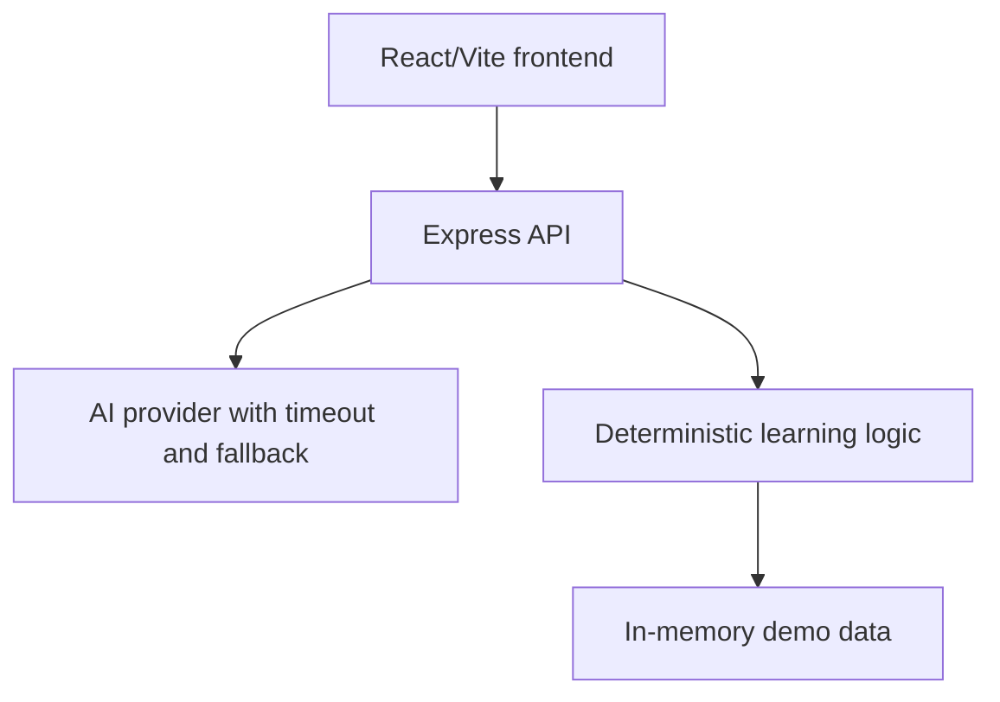

# LearnMate AI architecture

The frontend calls the backend through typed service modules. The backend validates input with Zod and keeps provider credentials server-side. AI suggests explanations, questions, curriculum structure, and assistant responses. Deterministic services own quiz scoring, topic classification, adaptive difficulty, progress, recommendation priority, revision scheduling, and analytics calculations. This separation prevents an uncertain model response from changing a score or revision date.

The current hackathon build intentionally uses demo/in-memory state rather than a database or authentication layer. Fallback responses are labelled in the UI.
